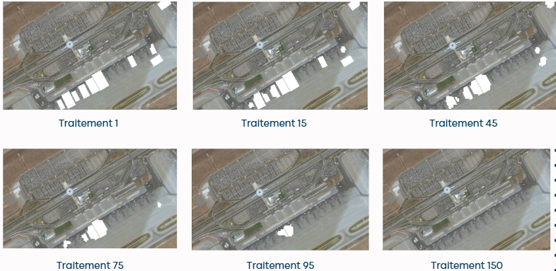

# Inpainting

Ce projet réalisé en python3 est l'implémentation de [cet algorithme](https://www.microsoft.com/en-us/research/wp-content/uploads/2016/02/criminisi_cvpr2003.pdf)

J'utilise la librairie OpenCV et Numpy.

## Processus de traitement 

